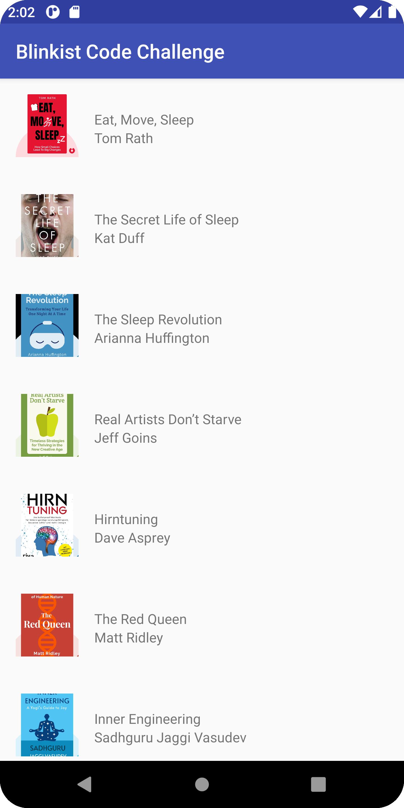
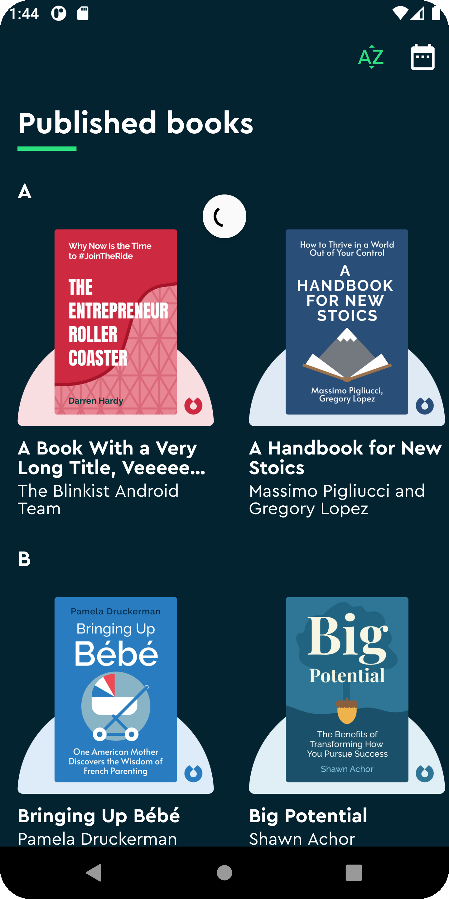
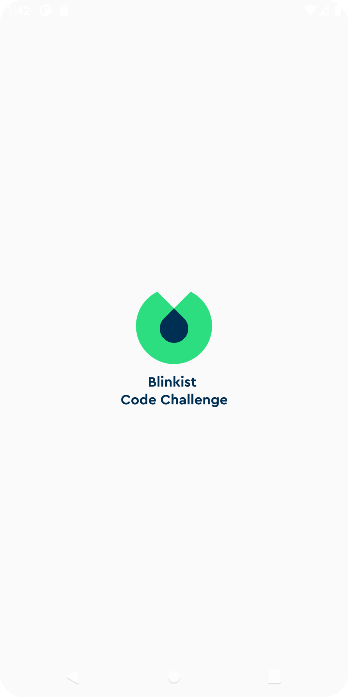
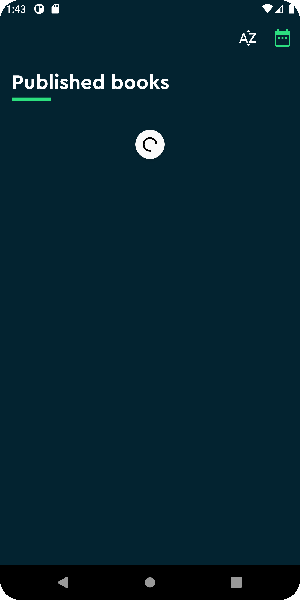
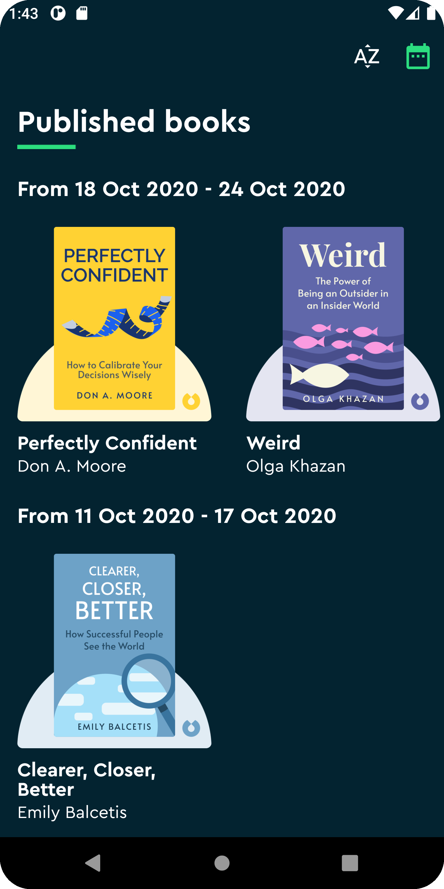
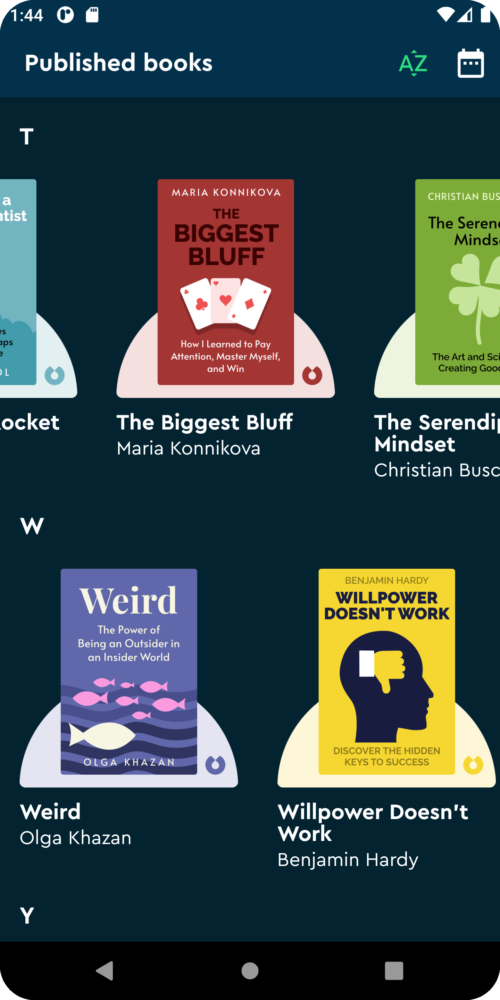
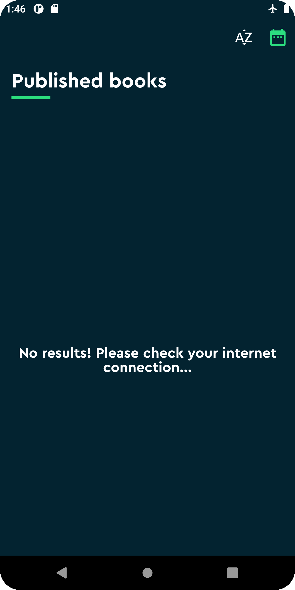

# blinkist-android-challenge

Hello Taco Team! I am thrilled to share my solution to
the [Blinkist coding challenge](https://blinkistpeople.notion.site/Android-Developer-Coding-Challenge-2faffa769a2447e4adb154f569eafa76)
.
First of all, please take a look at the final results:

| Before | After |
| ----- | ----- |
|  |  |

| Splash | First load | Weekly |
| ----- | ----- | ----- |
|  |  |  |

| Alphabetical | Refresh | Empty state |
| ----- | ----- | ----- |
|  |  |  |

Very pretty, isn't it? ✨

Okay, let's dive into more detail about the changes! 🚀

## Required Changes

> 1️⃣ "Add sections to the book list. Each section should represent a week and contain all the books
> published within that week."

I really like the UI of the Blinkist app, and making a vertical list with vertical sublists didn't
seem as fun. So, I decided to transform the UI of the given project to be more like Blinkist.

I used the **colors, typography, components, and behavior** from the Blinkist app. For this reason,
the book sections, grouped by week, scroll horizontally. Kotlin collections were very useful to
group the books by week, and I applied it with _Kotlin extensions_.

> 2️⃣ "Add some form of local persistence for the data received by the mocked API. The goal is to
> avoid unnecessary API calls and add offline capabilities."

To achieve this goal, I decided to use *Room* for local persistence and took the opportunity to earn
bonus points by using *Reactive programming*. So, I used **Room, RxJava, and a bit of Dependency
Injection with Dagger**. The result was very good. It always retrieve the books first from Room
and **only** call the API when the internet is available and, the database is empty or the user
forces a refresh.

## Bonus Points:

Regarding the bonus points, I also accomplished the following:

- **Sticky headers** in the book list using a custom ItemDecoration.
- Allow the user to **change the list arrangement**, in order to group the books alphabetically,
  where each section represents a letter and contains all the books that start with that letter. I
  achieved this by adding two toolbar actions, one for each type of arrangement, and filtering the
  books using Kotlin collections functions without making any requests to the server.
- I really love the result, so at least for me, this app provides a **delightful UI experience** ❤️.
- As I already mentioned, I used **Reactive programming** to retrieve the books from the
  Repository (Room for local and API for remote).

## More Bonus Points!

- **Collapsing toolbar**: I also added a collapsing toolbar component to make the UI prettier, with
  the animations, color, and background of the Blinkist app.
- **Tests**: I wrote **15 additional unit tests**, resulting in a total of 20 unit tests using *JUnit and Mockito*.
- **Improved the images**: I noticed that most of the images provided in the mock server were *cut
  or incomplete*, so I completed them using Figma. But later, I *discovered* that by changing a
  subpath in the URLs, I could **retrieve the complete images**.
- **More real Server**: I had worked with mock servers in the past, and having a hardcoded list in
  the project didn't make me happy. So, I created a **small server with Node.js** and deployed it
  with *Vercel* at [https://blinkist-coding-challenge-api.vercel.app/books](https://blinkist-coding-challenge-api.vercel.app/books).

- **More books!**: If you visited the API link or ran the app, you might be wondering *how I
  obtained all those book details*. Well, I realized that the **web version** of Blinkist had the
  **same lists** as the app, with images, titles, authors, and more. So, I **inspected the network
  calls during the site load** and retrieved the URL to the endpoint that fetched the book list for
  a particular category (Popular in Personal Development). **I obtained the JSON from that URL,
  filtered the properties I wanted to use**, and added them to the mock server. With this research,
  not only did I get more books, but I also gained more information about what a real API in
  Blinkist looks like, such as the **publishDate in ISO format ("2020-04-20T00:00:00.000+00:00")**.
- **API Levels test**: I also took the time to test the app on devices from **API 24 to API 31** to
  ensure the quality of the solution.

Thank you so much for reviewing this. See you soon in the _**Coding Challenge Review**_!
